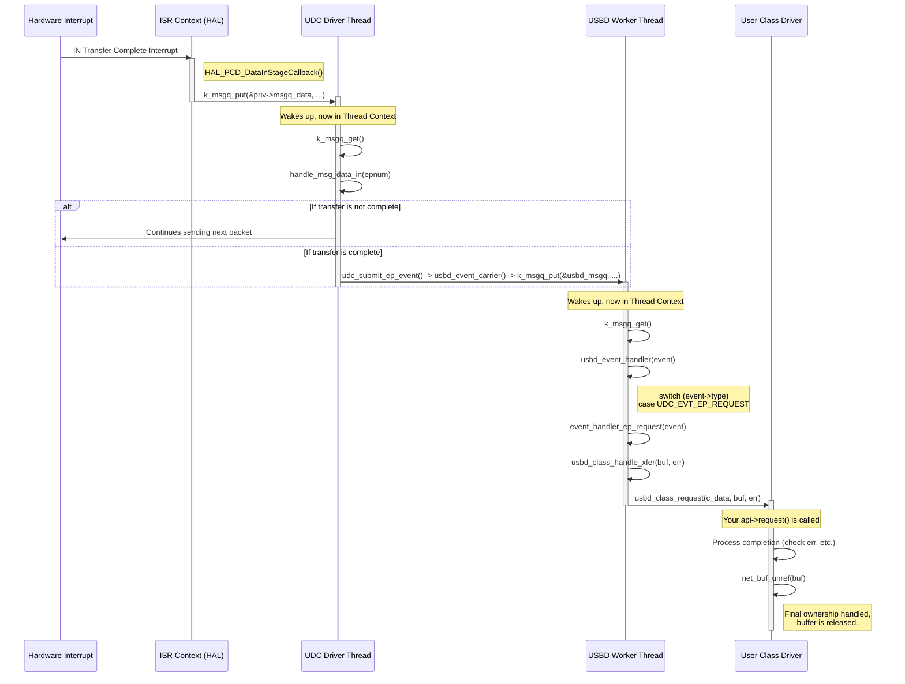

# USBD调用关系及结构笔记
## 接收数据

```mermaid
sequenceDiagram
    participant HW as Hardware Interrupt
    participant ISR as ISR Context (HAL)
    participant UDC_Thread as UDC Driver Thread
    participant USBD_Thread as USBD Worker Thread
    participant User_Code as User Class Driver

    %% 1. Hardware Interrupt -> HAL Callback (ISR Context)
    HW->>ISR: IN Transfer Complete Interrupt
    activate ISR
    Note right of ISR: HAL_PCD_DataInStageCallback()
    ISR->>+UDC_Thread: k_msgq_put(&priv->msgq_data, ...)
    deactivate ISR

    %% 2. UDC Driver Thread wakes up and processes the message
    Note over UDC_Thread: Wakes up, now in Thread Context
    UDC_Thread->>UDC_Thread: k_msgq_get()
    UDC_Thread->>UDC_Thread: handle_msg_data_in(epnum)
    alt If transfer is not complete
        UDC_Thread->>HW: Continues sending next packet
    else If transfer is complete
        UDC_Thread->>+USBD_Thread: udc_submit_ep_event() -> usbd_event_carrier() -> k_msgq_put(&usbd_msgq, ...)
    end
    deactivate UDC_Thread

    %% 3. USBD Worker Thread wakes up and handles the event
    Note over USBD_Thread: Wakes up, now in Thread Context
    USBD_Thread->>USBD_Thread: k_msgq_get()
    USBD_Thread->>USBD_Thread: usbd_event_handler(event)
    Note right of USBD_Thread: switch (event->type)<br/>case UDC_EVT_EP_REQUEST
    USBD_Thread->>USBD_Thread: event_handler_ep_request(event)
    USBD_Thread->>USBD_Thread: usbd_class_handle_xfer(buf, err)
    USBD_Thread->>+User_Code: usbd_class_request(c_data, buf, err)
    deactivate USBD_Thread

    %% 4. User Code (your class driver) is called
    Note over User_Code: Your api->request() is called
    User_Code->>User_Code: Process completion (check err, etc.)
    User_Code->>User_Code: net_buf_unref(buf)
    Note right of User_Code: Final ownership handled,<br/>buffer is released.
    deactivate User_Code
```